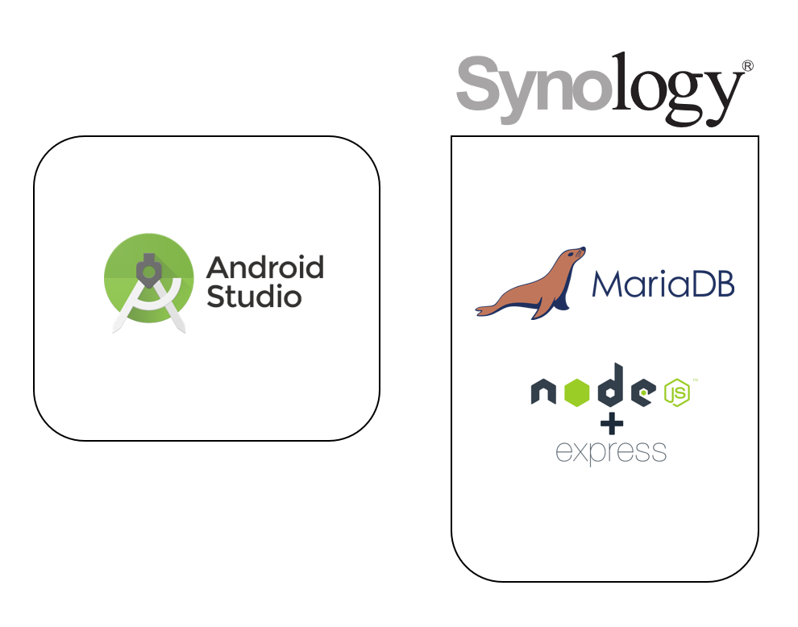
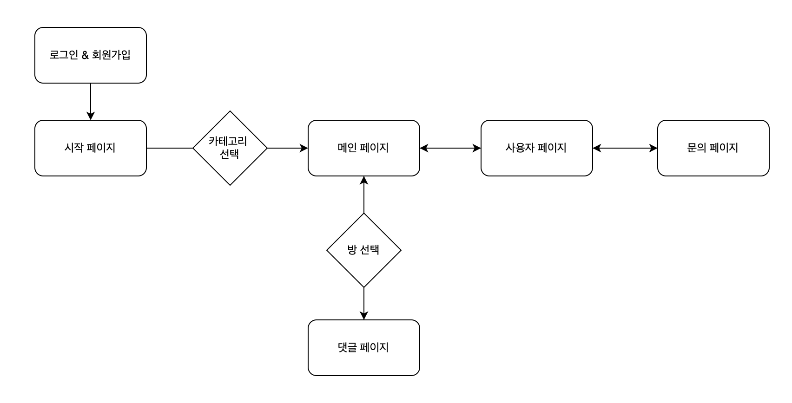
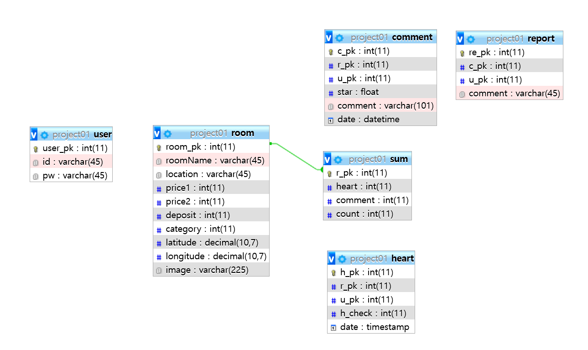

<a href="https://github.com/lsg1024/Univ_room">👉프론트 코드 보러가기👈 </a>

#  프로젝트 멤버

<table>
 <tr>
    <td align="center"></td>
    <td align="center"></td>
  </tr>
  <tr>
    <td align="center"><a href="https://github.com/lsg1024"><b>js</b></a></td>
    <td align="center"><a href="https://github.com/gywls20"><b>hj</b></a></td>
  </tr>

</table>

#  Contents

-   [개요](#개요)
-   [실행 화면](#실행화면)
-   [사용 도구](#사용기술)
-   [userFlow](#userflow)
-   [DB](#DB)

# 개요

Ho룸은 대학교 근처 자취방 정보를 제공하고 사용자들과 공유할 수 있는 앱 입니다. 우리 대학 특성상 자취방을 직접 집주인에게 연락해가며 자취방을 알아봐야하는 불편함이 존재합니다. 
이러한 문제를 해결하고자 학생들이 쉽게 자취방을 찾을 수 있도록 위치, 가격, 건물 사진과 같은 기본적인 정보를 제공 하는 앱을 만들고자 결심하였습니다.

# 실행화면

# 사용기술

# userflow

# DB

